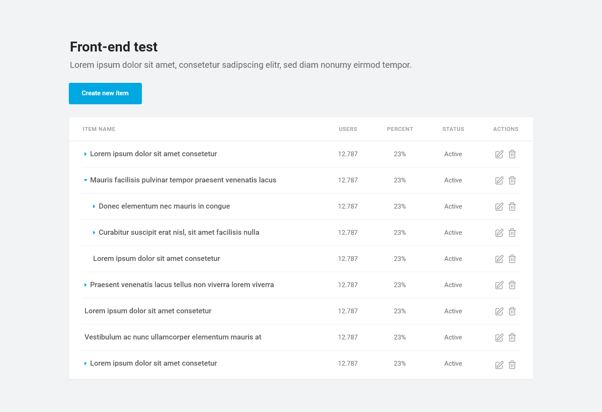

# Navegg Frontend Challenge - Create a Tree List

Many web applications use lists for data reporting. One well-used format is the **Tree List**. Your test is to recreate a short version of a Tree List with the following specifications:
  

## Briefing
 
The application must show the list in a tree format, the items may have multi-levels and the sub-levels must be collapsed, opening on click.

The application must-have features to create/edit an item, filling in the name and selecting which will be the parent item. And also an option to delete an item.

The Tree List needs to be updated after each change.  

We created an example to show you how a tree list looks like. But remember, **you won’t be evaluated by the look of the layout**, so feel free to find the best way to you, as long as you follow what is in the instructions above.

   
## Project requirements

- The minimum of the layout structure shown in the model (don't be afraid, we won’t judge your CSS)

- The project needs to be written in JavaScript (with framework or not)

- Every code (including the variables names) must be in English

- The project needs a documentation that anyone can install and test your application only by reading it

  

## The application needs to have the following features:

- List all items from [this json](https://raw.githubusercontent.com/Navegg/navegg-frontend-challenge/master/channels.json) considering the parent item, making a multi-level tree (see the template)

- Expand/collapse items with children clicking on the row

- An option to create a new item, with name, parent (select) and description (see item 2 of example)

- An option to edit existing item, changing the name, parent, and description

- An action to delete an item, if the item has children, delete them too

## At a minimum, this must:

- Be a recursive tree with N levels

- In the form, validate data (parent ID and item name)

- After add or change item, update the tree

    
## Bonus points for:

We use AngularJs internally, so using this framework in your application is a plus.

  

## What we are going to evaluate:
  
- You will **NOT** be evaluated for the layout accuracy, don't worry about CSS, our Designer takes care of it;

- Code abstraction! Functions that are reusable are better than hard code;

- Less code is better! If you can do the application with a little as possible of code, it’s a plus;

- Clean code! We need to read and understand what you’ve done;

- Documentation! Simple documentation that explains the main points.

## To conclude

Please submit your solution as a pull request to this repository or email a zip directly to challenge@navegg.com, and include in it:

-   a link to your working example (or instructions to run locally)
    
-   how long it took for you to get it done
    
-   what you would add/change if you had more time
    

**Thanks, and have fun!**